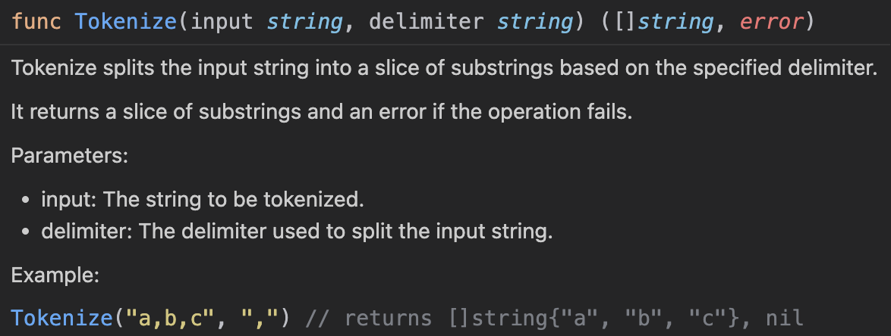
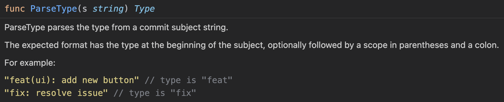

# Code Style Guide

> [!CAUTION]
> This is not a general Go style guide.
> This is the code style policy for this repository and its derived template-based projects

## TLDR

- [Declarative style](#declarative-style)
  - [Immutability](#immutability)
  - [No Setters](#no-setters)
  - [No Getters](#no-getters)
  - [Functional options](#functional-options)
  - [One type — one constructor](#one-type--one-constructor)
  - [No logic in constructors](#no-logic-in-constructors)
  - [Custom types](#custom-types)
- [No newlines in functions](#no-newlines-in-functions)
- [No nil](#no-nil)
  - [Nullable](#nullable)
  - [Pointer structs](#pointer-structs)
  - [Errors can be nil](#errors-can-be-nil)
- [Document all](#document-all)
  - [What the function does](#what-the-function-does)
  - [What the field stores](#what-the-field-stores)
  - [Sentence structure](#sentence-structure)
  - [Multiple parameters / return values](#multiple-parameters--return-values)
  - [Single parameter / return values](#single-parameter--return-value)
  - [No arguments / return values](#no-arguments--return-values)
- [Exporting](#exporting)
  - [Functions must be exported](#functions-must-be-exported)
  - [Any type must have a constructor](#any-type-must-have-a-constructor)
  - [Types must be exported](#types-must-be-exported)
  - [Fields must be unexported](#fields-must-be-unexported)
- [Test all](#test-all)
  - [Testify](#testify)
  - [Separate test packages](#separate-test-packages)
  - [Structs in tests](#structs-in-tests)
  - [Parallel tests](#parallel-tests)

## Declarative style

Favor a declarative programming style over imperative.
That means expressing the logic of computation without describing its control flow.

### Immutability

> [!TIP]
> Immutability is the key to solve a lot of problems
that could be made in the projects!

The object cannot be changed after created!
If you really need to do it then create the new one
with the new value but specify it in a constructor.

### No setters

> [!IMPORTANT]
> Setters are evil

Avoid defining setter methods that simply assign values to struct fields.
If you need to modify a field it seems that you wrong design of your struct.
The most of the values **must be immutable** after the struct creation.
Consider to create a new instance of the struct with the desired values instead.

**❌ Bad**:

```go
package order

type Order struct {
    price int64
}

func NewOrder(price int64) *Order {
    return &Order{
        price: price,
    }
}

func (o *Order) GetPrice() int64 {
    return o.price
}

func (o *Order) SetPrice(price int64) {
    o.price = price
}
```

```go
package main

import (
    "fmt"
    "your_module/order"
)

func main() {
    ord := order.NewOrder(100)
    processOrder(ord)
    // Unexpectedly prints 200, but should be 100
    fmt.Println("Order price after processing:", ord.GetPrice())
}

func processOrder(o *order.Order) {
    o.SetPrice(200) // Oh, no! Some developer changed the price directly!
}
```

**✅ Good**:

You cannot update values in the object.
You must copy this object and change the values on its creation.s

### No getters

> [!IMPORTANT]
> Getters are evil

If you do not use setters - getters are useless.
If you really need to get some data from the struct - just omit `Get` prefix
in the method name. That is all!

If the method returns, for example, the `price` field - just name it `Price()`.
Why do you need `GetPrice()`?
Does the `Price() int64` not returns the price?
Why do you need `Get` prefix? Just avoid it.

**✅ Good**:

```go
package order

type Order struct {
    uuid string
    status string
    price int64
}

func NewOrder(
    uuid string,
    status string,
    price int64,
) *Order {
    return &Order{
        uuid: uuid,
        status: status,
        price: price,
    }
}

func (*Order) UUID() string {
    return o.uuid
}

func (o *Order) Status() string {
    return o.status
}

func (o *Order) Price() int64 {
    return o.price
}
```

```go
package main

import (
    "fmt"
    "your_module/order"
)

func main() {
    ord1 := order.NewOrder("uuid1", "status1", 100)
    ord2 := order.NewOrder("uuid2", "status2", 200)
    fmt.Println(
        "Order 1: %s, %s, %s:",
        ord1.UUID(),
        ord1.Status(),
        ord1.Price(),
    ) // Prints uuid1, status1, 100
    fmt.Println(
        "Order 2: %s, %s, %s:",
        ord2.UUID(),
        ord2.Status(),
        ord2.Price(),
    ) // Prints uuid2, status2, 200
}

func processOrder(o *order.Order) {
    // There is no any method changes the input order!
}
```

Look! No `Get` prefix! Just `Price()` method that returns the price.
And we **do not have any setters**!
The `price` field is immutable after the struct created!
**We are sure that no one can change the price unexpectedly!**

### Functional options

> 💡 All the values could be set in a constructor

All! Remember that! Even there are a lot of fields in the struct,
they still could be specified in a constructor via **functional options**.

**❌ Bad:**

File: *order.go*

```go
package order

type Order struct {
    uuid string
    status string
    userID string
    address string
    phone string
    price int64
    priority uint8
}

func NewOrder(
    uuid string,
    status string,
    userID string,
    address string,
    phone string,
    price int64,
    priority uint8,
) *Order {
    return &Order{
        uuid: uuid,
        status: status,
        userID: userID,
        address: address,
        phone: phone,
        price: price,
        priority: prioriry,
    }
}
```

**✅ Good:**

File: *order.go*

```go
package order

type Order struct {
    uuid string
    status string
    userID string
    address string
    phone string
    price int64
    priority uint8
}

func NewOrder(
    uuid string,
    status string,
    ...opts Option,
) *Order {
    o := &Order{
        uuid: uuid,
        status: status,
    }
    for _, opt range opts {
        opt(o)
    }
    return o
}
```

File: *order.go*

```go
package order

type Option func(*Order)

func WithPrice(p int64) Option {
    return func(o *Order) {
        o.price = p
    }
}


func WithAddress(addr string) Option {
    return func(o *Order) {
        o.address = addr
    }
}

func WithPhone(phone string) Option {
    return func(o *Order) {
        o.phone = phone
    }
}

// etc...
```

File: *main.go*

```go
package main

import "github.com/you/repo/order"

func main() {
    fullOrder := order.NewOrder(
        "uuid1",
        "status1",
        order.WithPrice(100)
        order.WithAddress("Los Santos, Groove street"),
        order.WithPhone("88005553535")
    )
    orderWithRequiredOnly := order.NewOrder(
        "uuid1",
        "status1",
    )
    orderWithPrice := order.NewOrder(
        "uuid1",
        "status1",
        order.WithPrice(100),
    )
}
```

Look! Here the type has many fields and only one constructor
that could be extended with functional options if we need
and allows us to create objects with different sets of values.

That way looks like ***overload*** in OOP languages like Java/C#/C++.

### One type — one constructor

According to functional options you may assume
that it may be optimized with making several constructors
for specific situations
to create objects with pre-defined set of arguments.
That is better than specifing a lof of arguments in the main constructor,
but one day you may have so many situations that you won't able to maintain.

**❌ Bad:**

```go
package order

type Order struct {
    uuid string
    status string
    userID string
    address string
    phone string
    price int64
    priority uint8
}

func NewOrder(
    uuid string,
    status string,
) *Order {
    return &Order{
        uuid: uuid,
        status: status,
    }
}

func NewOrderWithPrice(
    uuid string,
    status string,
    price int64,
) *Order {
    return &Order{
        uuid: uuid,
        status: status,
        price: price,
    }
}

func NewOrderWithAddress(
    uuid string,
    status string,
    addr string,
) *Order {
    return &Order{
        uuid: uuid,
        status: status,
        address: addr,
    }
}

func NewOrderWithPriceAndAddress(
    uuid string,
    status string,
    price int64,
    addr string,
) *Order {
    return &Order{
        uuid: uuid,
        status: status,
        price: price,
        address: addr,
    }
}
```

**💀 Unacceptable:**

File: *order.go*

```go
package order

type Order struct {
    uuid string
    status string
    userID string
    address string
    phone string
    price int64
    priority uint8
}

func NewOrder(
    uuid string,
    status string,
    userID string,
    address string,
    phone string,
    price int64,
    priority uint8,
) *Order {
    return &Order{
        uuid: uuid,
        status: status,
        userID: userID,
        address: address,
        phone: phone,
        price: price,
        priority: prioriry,
    }
}
```

**✅ Good:**

File: *order.go*

```go
package order

type Order struct {
    uuid string
    status string
    userID string
    address string
    phone string
    price int64
    priority uint8
}

func NewOrder(
    uuid string,
    status string,
    ...opts Option,
) *Order {
    o := &Order{
        uuid: uuid,
        status: status,
    }
    for _, opt range opts {
        opt(o)
    }
    return o
}
```

File: *option.go*

```go
package order

type Option func(*Order)

func WithPrice(p int64) Option {
    return func(o *Order) {
        o.price = p
    }
}

func WithAddress(addr string) Option {
    return func(o *Order) {
        o.address = addr
    }
}

func WithPhone(phone string) Option {
    return func(o *Order) {
        o.phone = phone
    }
}

// etc...
```

### No logic in constructors

Constructors are meant to initialize and return instances of types
and should not contain any logic or side effects.
They should simplify set up the struct with default values or provided parameters.

Especially do not return error! Error handling is also logic that is prohibited.

**❌ Bad:**

```go
func NewOrder(
    uuid string,
    status string,
    price int64,
) *Order {
    o := &Order{
        uuid: uuid,
        status: status,
        price: price,
    }
    if price < 0 {
        o.price = 0
    } 
    if price == 0 && status == "" {
        o.status = "new"
    }
    return o
}
```

**💀 Unacceptable:**

```go
func NewOrder(
    uuid string,
    status string,
    price int64,
) (*Order, error) {
    o := &Order{
        uuid: uuid,
        status: status,
        price: price,
    }
    if price < 0 {
        return nil, errors.New("empty price")
    } 
    if status == "" {
        return nil, errors.New("empty status")
    }
    return o
}
```

**✅ Good:**

```go
func NewOrder(
    uuid string,
    status string,
    price int64,
) *Order {
    return &Order{
        uuid: uuid,
        status: status,
        price: price,
    }
}
```

Constructor can accept and move values from the arguments into the fields.
> 💡 This is what is precisely forms **encapsulation**

### Custom types

Use type defintion to create custom types covers your business logic.
Especially when you denormalize your struct to optimize usage of your program.
In that case you may impair the readability of the project.

The main tip to catch that — you call fieilds with two words or more.

**❌ Bad:**

File: *order.go*

```go
package order

type Order struct {
    userID string
    userPhone string
    deliveryAddress string
    status string
    price uint64
}

func (o *Order) UserID() string {
    return o.userID
}

func (o *Order) UserPhone() string {
    return o.userPhone
}

func (o *Order) DeliveryAddress() string {
    return o.deliveryAddress
}

func (o *Order) Status() string {
    return o.status
}

func (o *Order) IsStatusNew() bool {
    return o.status == "new"
}

func (o *Order) IsStatusDelivered() bool {
    return o.status == "delivered"
}

func (o *Order) Price() uint64 {
    return o.price
}
```

**✅ Good:**

File: *order/order.go*

```go
package order

import (
    "github.com/you/repo/money/price"
    "github.com/you/repo/order/status"
    "github.com/you/repo/user"
)

type Order struct {
    delivery Delivery
    user user.Identity
    status status.Status
    price price.Price
}

func NewOrder(s status.Status, opts ...Option) *Order {
    o := &Order{
        status := s
    }
    for _, opt range opts {
        opt(o)
    }
    return o
}

func (o *Order) Delivery() Delivery {
    return o.delivery
}

func (o *Order) User() user.Identity {
    return o.delivery
}

func (o *Order) Status() status.Status {
    return o.status
}

func (o *Order) Price() price.Price {
    return o.price
}
```

File: *order/delivery.go*

```go
package order

import (
    "github.com/you/repo/delivery"
)

type Delivery struct {
    addr delivery.Address
}

func NewDelivery(addr deliveryAddress) Delivery {
    return Delivery{
        addr: addr
    }
}

func (d Delivery) Address() delivery.Address {
    return d.addr
}
```

File: *order/option.go*

```go
package order

import (
    "github.com/you/repo/money/price"
    "github.com/you/repo/delivery"
    "github.com/you/repo/user"
)
type Option func (*Order)

func WithDelivery(d Delivery) Option {
    return func(o *Order) {
        o.delivery = d
    }
}

func WithUser(usr user.Identity) Option {
    return func(o *Order) {
        o.user = usr
    }
}

func WithPrice(p price.Price) Option {
    return func(o *Order) {
        o.price = p
    }
}
```

File: *order/status/status.go*

> 💡 That way allows as to change initial type easy

```go
package status

type Status uint8

const (
    New = 0
    Delivered = 1
)

func (s Status) IsNew() bool {
    return s == New
}

func (s Status) IsInProgress() bool {
    return s == InProgress
}

func (s Status) IsDelivered() bool {
    return s == Delivered
}
```

⚠️ To prevent creating unexpected `Status` we should omit constructor
and provide usage only with constants.

File: *user/identity.go*

```go
package user

import "github.com/you/repo/contact"

type Identity struct {
    phone contact.Phone
    id ID
}

func NewIdentity(id ID, opts ...IdentityOption) Identity {
    i := Identity{
        id: id,
    }
    for _, opt := range opts {
        opt(i)
    }
    return i
}

func (i Identity) String() string {
    // That's can be useful in some logs or debugging.
    return i.id.String()
}

func (i Identity) Phone() contact.Phone {
    return i.phone
}

func (i Identity) ID() ID {
    return i.id
}
```

File: *user/identity_option.go*

```go
package user

import "github.com/you/repo/contact"

type IdentityOption func (i *Identity)

func (i Identity) WithPhone(p contact.Phone) IdentityOption {
    return func(i *Identity) {
        i.phone = p
    }
}
```

File: *user/id.go*

```go
package user

type ID string

func (i ID) String() string {
    return string(i)
}

// Here you can add some code covers logic of the identifiers
// for example checking if the id has new structure or
// if the id created after a year required.
```

File: *contact/phone.go*

```go
package contact

type Phone string

func (p Phone) String() string {
    return string(p)
}

// Here you can make logic for phones
// for example, extracting country code or get its provider name.
```

You may say that the "Good" code is too bigger
and complicated than "Bad". That's a mistake all developers
do once at least.
This way obligate you to think about the structure and maintainability
in the start of developing so you can cover with tests each point of
the main object or its secondary ones.
And think about that each type is not totally depends of others
so you can modify it quite easy.

## No newlines in functions

Avoid unnecessary newlines within function bodies to maintain readability and compactness.

**❌ Bad:**

```go
func (c Config) Validate() error {
    if с.Empty() {
        return nil
    }

    if с.usr == "" {
        return errors.New("empty username")
    }

    if с.pwd == "" {
        return errors.New("empty password")
    }
    
    return nil
}
```

**✅ Good:**

```go
func (c Config) Validate() error {
    if с.Empty() {
        return nil
    }
    if с.usr == "" {
        return errors.New("empty username")
    }
    if с.pwd == "" {
        return errors.New("empty password")
    }
    return nil
}
```

First time you may decide that this rule is too harsh and excessive.
Please believe me! That way makes us to build very small functions and simplify the code.
Just try it and you will see the benefits soon!

## No nil

> [!TIP]
> Just do not use `nil` and your code will become much more reliable!

As you can know the `nil` is the same as `NULL` in Java, C++, or `None` in Python.
And we **totally prohibit** this usage in our projects.

### Nullable

Long time ago `NULL` was created to display that value was not set in RDBMS and soon it arrived to the code.
In that moment it seemed to be useful and friendly for developers
but now it looks like a **bad manner**.

Why you should use it?
Why you need to know that the values was set?
Can't you understand that the value was not set with empty value?
What if a user set precisely empty value?
You can say that you have to check that case.
OK, but think about maintanance in your code...

**❌ Bad:**

```go
package user

type User struct {
    name *string
}

func NewUser(name *string) *User {
    return &User{
        name: name
    }
}

func (u *User) Name() *string {
    return u.string
}

// ...
```

```go
package main

func main() {
    // ...
    u := NewUser("John Doe")
    if name := u.Name(); name == "" { // will panic if the flag would be nil!
        // ...
    } else {
        // ...
    }
    // ...
}
```

Or how it will look like if we don't know whether the value is nil or not?

```go
package main

func main() {
    // ...
    var name *string
    if v != nil {
        name = &string(v)
    }
    u := NewUser(name)
    if nam := u.Name(); nam == "" { // will panic if the flag would be nil!
        // ...
    } else {
        // ...
    }
    // ...
}
```

You may say "just check for nil":

```go
package main

func main() {
    // ...
    var name *string
    if v != nil {
        name = &string(v)
    }
    if name := u.Name(); name != nil && name == "" {
        // ...
    } else if name == "" {
        // ...
    } else {
        // ...
    }
    // ...
}
```

It would be if you decice to add check to the predicate like this:

```go
// ...
func (u *User) Name() string {
    if u.name == nil {
        return string
    }
    return u.name
}
// ...
```

But any solving will look like a crunch in your code
and at the same moment you lost the one "feature" of the `NULL`.
So why you still use it?

If your really need to check whether some value is really set by a user
you should do like this:

**✅ Good:**

File: *strings/string.go*.

```go
package strings

type String struct {
    v string
    ex bool
}

func NewString(v string, opts ...Option) String {
    s := String{
        v: v,
    }
    for _, opt := range opts {
        opt(&s)
    }
    return s
}

func (s String) Value() string {
    return s.v
}

func (s String) Empty() bool {
    return s.v != ""
}

func (s String) Exists() bool {
    return s.ex || s.v != ""
}
```

File: *strings/option.go*.

```go
package strings

type Option func(*String)

func WithExists(exists bool) Option {
    return func(s *String) {
        s.ex = exists
    }
}
```

```go
package main

func main() {
    // ...
    usr := NewUser(
        strings.NewString("John Doe"),
    )
    if nam := user.Name(); !nam.Exists() {
        
    } else if nam.Empty() {
        
    } else {

    }
    // ...    
}
// ...
```

What if we don't know whether the value is not empty? Then:

```go
package main

func main() {
    // ...
    usr := NewUser(
        strings.NewString(name),
        strings.WithExists(name != ""),
    )
    if nam := user.Name(); !nam.Exists() {
        // ...
    } else if nam.Empty() {
        // ...
    } else {
        // ...
    }
    // ...    
}
// ...
```

That way you delegate the logic to check for nil to `User`,
so you can never check for it and get rid of nil-pointer errors.
These errors look like childish mistakes that develovers just forgot to handle.

### Pointer structs

> [!TIP]
> Prevent and catch all nil-usage except of errors

If we store structs with a pointer and do not use declarative style,
we are guaranteed to meet panics with nil-pointer error.

Do not check objects and values for nil like that:

**❌ Bad:**

File: **order/order.go**

```go
package order

type Order struct {
    User *User
}

func (o *Order) GetUserName() string {
    return o.User.Name
}
```

File: **order/user.go**

```go
package order

type User struct {
    Name string
}
```

File: **main.go**

```go
package main

func main() {
    // ...
    o := new(order.Order)
    if usr != nil {
        o.User = usr
    }
    // ...
    fmt.Println(o.User.Name) // will panic because o.User is nil
}
// ...
```

If we apply declarative style it will look like this:

**✅ Good:**

File: **order/order.go**

```go
package order

type Order struct {
    user *User
}

func NewOrder(usr *User) *Order {
    return &Order{
        user: usr,
    }
}

func (o *Order) User() *User {
    return o.User.Name
}
```

File: **order/user.go**

```go
package order

type User struct {
    name string
}

func NewUser(name string) *User {
    return &User{
        name: name,
    }
}

func (u *User) Name() {
    return u.name
}
```

File: **main.go**

```go
package main

func main() {
    // ...
    o := order.NewOrder(usr)
    // ...
    fmt.Println(o.User().Name())
}
// ...
```

And you may say that if user is still nil it will panic.
Yes, it does. But this code is not able to fix all problems with nil.

> [!IMPORTANT]
> Pointer it is precisely a pointer and you should not store nil in the struct fields

Also consider usage without pointers.

### Errors can be nil

The one thing you can to check for `!= nil` is error.
But after you have read the upper paragraphs
you may think that we have to check errors something like that:

```go
package main

func main() {
    // ...
    value := cache.Get(ctx, "key")
    if value.Errored() {
        log.Fatalf("failed to get value from cache: %w", err.Err())
    }
    // handle the value...    
}
```

And I was a fan of this style.
But one day I recognized that when get these values wrapps error inside itself — **it obligates you to know that this staff may be errored**.
And that is not good.

The best way you can do to check for errors is checking for nil.
Compare the code with this:

```go
package main

func main() {
    // ...
    value, err := cache.Get(ctx, "key")
    if err != nil {
        log.Fatalf("failed to get value from cache: %w", err.Err())
    }
    // handle the value...    
}
```

This way obligates you to handle error
and many linters will alert you about that.

Maybe the first example is truly object oriented style
but it is not idiomatic in Go and the handling becomes not maintainable.

## Document all

> [!IMPORTANT]
> Even unexported! Even if the value is too obvious! Just document it!

Every package, function, method, field and type must have a clear
and concise comment explaining its purpose and usage.
Use [GoDoc conventions](https://go.dev/doc/comment) for documentation.

### What the function does

Describe what the function does and not how it does it.
The doc have to include a summary of the function's behavior,
its inputs, outputs, and any side effects.

### What the field stores

Describe what the field stores and how it is used.

### Sentence structure

The first sentence should be a short summary that starts with the name of the function.
**After a blank line**, provide more detailed information if necessary.
The comment should be written in full sentences and be clear
to someone unfamiliar with the code.

### Multiple parameters / return values

If the function has more than one parameter or returns values,
describe each of them clearly.
Specify the type and purpose of each parameter and return value.

```go
// Tokenize splits the input string into a slice of substrings based on the specified delimiter.
//
// It returns a slice of substrings and an error if the operation fails.
//
// Parameters:
//   - input: The string to be tokenized.
//   - delimiter: The delimiter used to split the input string.
// 
// Example:
//
//  Tokenize("a,b,c", ",") // returns []string{"a", "b", "c"}, nil
func Tokenize(input string, delimiter string) ([]string, error)
```

**How it looks in VSCode:**



### Single parameter / return value

If the function has only one parameter and one return value,
a brief description is sufficient but if necessary, you can still elaborate.

**For example:**

```go
// ParseType parses the type from a commit subject string.
//
// The expected format has the type at the beginning of the subject,
// optionally followed by a scope in parentheses and a colon.
//
// For example:
//
//  "feat(ui): add new button" // type is "feat"
//  "fix: resolve issue" // type is "fix"
func ParseType(s string) Type
```

**How it looks in VSCode:**



### No arguments / return values

If the function has no parameters or does not return any values,
a simple description of its purpose is sufficient.

**For example:**

```go
// Initialize sets up the necessary configurations for the application.
func Initialize()
```

### No comments

## Exporting

### Functions must be exported

Every function or method is intended to be used outside its package and must be exported
(i.e., its name should start with an uppercase letter).
This makes the function accessible to other packages.

We do not allow any unexported functions in the codebase!

> ⚠️ If you dedicate a code in a function - it must be accessible from others outside the package!

**❌ Bad:**

```go

```

#### Functions must be exported: config example

**❌ Bad:**

```go
package main

func main() {
    cfg, err := file.ReadConfig("config.json")
    if err != nil {
        log.Fatal(err)
    }
    // Use cfg...
}
```

```go
package file

// ReadConfig reads and parses a config file.
func ReadConfig(path string) (*Config, error) {
    data, err := readFile(path)
    if err != nil {
        return nil, err
    }
    return parseConfig(data)
}

func readFile(path string) ([]byte, error) {
    return os.ReadFile(path)
}

func parseConfig(data []byte) (*Config, error) {
    var cfg Config
    err := json.Unmarshal(data, &cfg)
    return &cfg, err
}
```

**✅ Good:**

```go
package main

import (
    "log"
    "your_module/file"
)

func main() {
    cfg, err := file.ReadConfig("config.json")
    if err != nil {
        log.Fatal(err)
    }
    // Use cfg...
}
```

```go
package file

// ReadConfig reads and parses a config file.
func ReadConfig(path string) (*Config, error) {
    data, err := Read(path)
    if err != nil {
        return nil, err
    }
    return ParseConfig(data)
}

// Read reads a file and returns its contents.
func Read(path string) ([]byte, error) {
    return os.ReadFile(path)
}

// ParseConfig parses config data from bytes.
func ParseConfig(data []byte) (*Config, error) {
    var cfg Config
    err := json.Unmarshal(data, &cfg)
    return &cfg, err
}
```

**⭐️ Better:**

```go
package main

import (
    "log"
    "your_module/file"
    "your_module/config"
)

func main() {
    data, err := file.Read("config.json")
    if err != nil {
        log.Fatal(err)
    }
    cfg, err := config.ParseConfig(data)
    if err != nil {
        log.Fatal(err)
    }
    // Use cfg...
}
```

```go
package file

// Read reads a file and returns its contents.
func Read(path string) ([]byte, error) {
    return os.ReadFile(path)
}
```

```go
package config

func ParseConfig(data []byte) (*Config, error) {
    var cfg Config
    err := json.Unmarshal(data, &cfg)
    return &cfg, err
}
```

### Any type must have a constructor

Each struct or type must have a constructor function that initializes and returns an instance of the struct.
The constructor should be named `New<TypeName>` and should set default values for the struct's fields if necessary.

### Types must be exported

All structs and types that are intended to be used outside their package must be exported
(i.e., their names should start with an uppercase letter).
This allows other packages to define them in outer function signatures.

But! **The fields of the structs must be unexported** to maintain encapsulation
and prevent direct access from outside the package.

### Fields must be unexported

**All struct fields must be unexported** to maintain encapsulation and prevent direct access from outside the package.

When defining structs, ensure that all fields are unexported (i.e., start with a lowercase letter).
This encapsulation helps maintain control over how data is accessed and modified.

## Test all

Every new feature or bugfix must include corresponding tests.
Use Go's testing package to write unit tests that cover various scenarios and edge cases.

### Testify

Use [testify package](https://github.com/stretchr/testify)
to make **asserts** in your tests.

> ❌ Never use `t.Error()` because it definetely damages the reading!

**❌ Bad:**

VSCode and JetBrains Goland can create unit-tests templates in one click
that extremely improves your productivity but it still needs to refactor
the `t.Run()` section!

```go
package file

import "testing"

func TestName_String(t *testing.T) {
    tests := []struct {
        name string
        n    Name
        want string
    }{
        // TODO: Add test cases.
    }
    for _, tt := range tests {
        t.Run(tt.name, func(t *testing.T) {
            if got := tt.n.String(); got != tt.want {
                t.Errorf("Name.String() = %v, want %v", got, tt.want)
            }
        })
    }
}
```

**✅ Good:**

```go
package file

import (
    "testing"

    "github.com/stretchr/testify/assert"
)

func TestName_String(t *testing.T) {
    tests := []struct {
        name string
        n    Name
        want string
    }{
        // TODO: Add test cases.
    }
    for _, tt := range tests {
        t.Run(tt.name, func(t *testing.T) {
            assert.Equal(
                t, 
                tt.want,
                tt.n.String()
            ) 
        })
    }
}
```

> 💡 Do not ignore `require` in testify package to ensure yourself
that some field is not nil pointer
or the implementation must have some functionality

### Separate test packages

Add suffix `_test` to the name of the package you test.
It obligates you to import the implementation
and you have to declare a constructor for the type you test.

**❌ Bad:**

```go
package file

import (
    "testing"

    "github.com/stretchr/testify/assert"
)

func TestName_String(t *testing.T) {
    t.Parallel()
    tests := []struct {
        name string
        n    Name
        // ...
    }{
        {
            name: "some case",
            n: Name{ // Allows to create with a literal
                value: "example.txt", // With unexported fields!
            },
            // ...
        }
    }
    for _, tt := range tests {
        t.Run(tt.name, func(t *testing.T) {
            // ...
        })
    }
}
```

**✅ Good:**

```go
package file_test

import (
    "testing"

    "github.com/you/repo/file"
)

func TestName_String(t *testing.T) {
    t.Parallel()
    tests := []struct {
        name string
        n    file.Name
        // ...
    }{
        {
            name: "some case",
            n: NewName("example.txt"), // Obligates to use the constructor
            // ...
        }
    }
    for _, tt := range tests {
        t.Run(tt.name, func(t *testing.T) {
           // ...
        })
    }
}
```

Using unexported fields in tests is also prohibited
excluding the test structs in which we define the test cases.
But it still does not allow you to use this fields of the implementation that you test!

### Structs in tests

Create the structs to justify bootraping the cases in your tests.
It improves declaration and understafing by reading of your test cases.

**❌ Bad:**

```go
package config

import "testing"

func TestParseConfig(t *testing.T) {
    tests := []struct {
        name    string
        fname   string
        want    Config
        wantErr bool
    }{
        {
            name:    "ok",
            fname:   "path/to/config",
            // ...
            wantErr: false,
        },
        {
            name:    "failed to parse",
            fname:   "path/to/config",
            // ...
            wantErr: true,
        },
    }
    for _, tt := range tests {
        t.Run(tt.name, func(t *testing.T) {
            got, gotErr := ParseConfig(tt.fname)
            assert.Equal(
                t,
                tt.want,
                got,
            )
            if tt.wantErr {
                assert.Error(t, gotErr)
            } else {
                assert.NoErrorf(
                    t,
                    gotErr,
                    "unexpected error: %v",
                    gotErr,
                )
            }
        })
    }
}
```

**✅ Good:**

```go
package config_test

import (
    "testing"

    impl "github.com/you/repo/config"
)

func TestParseConfig(t *testing.T) {
    type args struct{
        fname string
    }
    type want struct {
        config  impl.Config
        errored bool
    }
    tests := []struct {
        name string
        args args
        want want
    }{
        {
            name: "ok",
            args: args{
                fname: "path/to/file",
            }
            want: want{
                config:  impl.NewConfig(
                    // ...
                ),
                errored: false,
            }
        },
        {
            name: "failed to parse",
            args: args{
                fname: "path/to/file",
            }
            want: want{
                config:  impl.Config{},
                errored: true,
            }
        },
    }
    for _, tt := range tests {
        t.Run(tt.name, func(t *testing.T) {
            got, gotErr := impl.ParseConfig(tt.args.fname)
            assert.Equal(
                t,
                tt.want.config,
                got,
            )
            if tt.want.errored {
                assert.Error(t, gotErr)
            } else {
                assert.NoErrorf(
                    t,
                    gotErr,
                    "unexpected error: %v",
                    gotErr,
                )
            }
        })
    }
}
```

**⭐️ Better:**

```go
package config_test

import (
    "testing"

    impl "github.com/you/repo/config"
)

func TestParseConfig(t *testing.T) {
    type args struct{
        fname string
    }
    type want struct {
        config  impl.Config
        err error
    }
    tests := []struct {
        name string
        args args
        want want
    }{
        {
            name: "ok",
            args: args{
                fname: "path/to/file",
            }
            want: want{
                config: impl.NewConfig(
                    // ...
                ),
                err:    nil,
            }
        },
        {
            name: "failed to parse",
            args: args{
                fname: "path/to/file",
            }
            want: want{
                config:  impl.Config{},
                errored: impl.ErrNotFound,
            }
        },
    }
    for _, tt := range tests {
        t.Run(tt.name, func(t *testing.T) {
            got, gotErr := impl.ParseConfig(tt.args.fname)
            assert.Equal(
                t,
                tt.want.config,
                got,
            )
            assert.ErrorIs(
                t,
                gotErr,
                tt.want.err,
            )
        })
    }
}
```

That way you bring declarative style to describe the test cases
and the code supposed to be more readable and understable.

### Parallel tests

Use `t.Parallel()` in all test cases where it could be used.
But be careful to use it in the cases with asyncronious implementation
because it may bring your test flacky so you may spend a lot of time to find out
*yet another test you skip every second CI-job*
